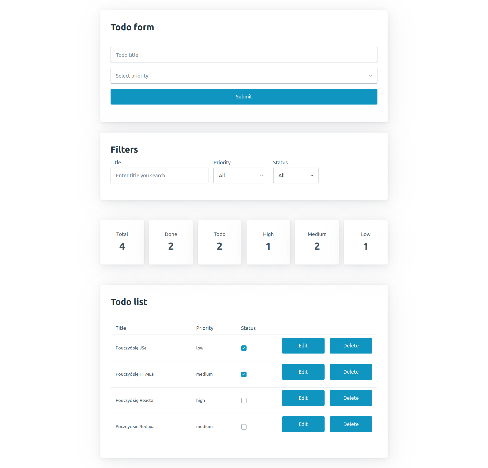
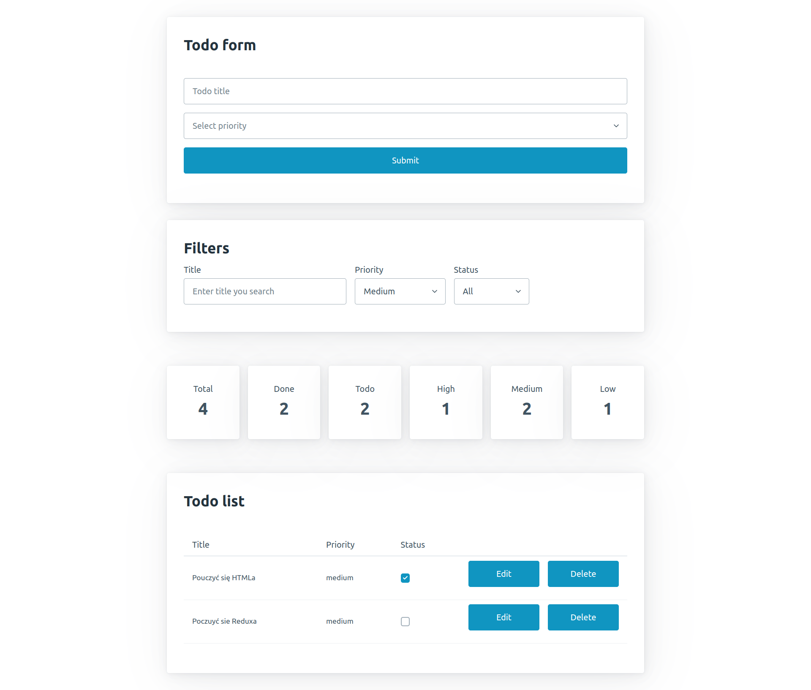
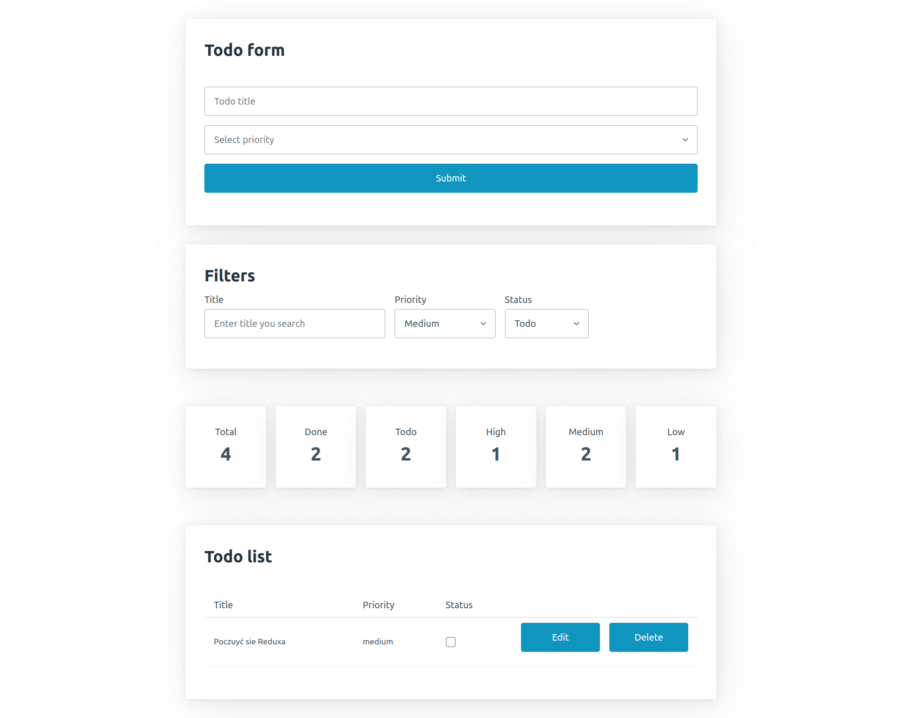
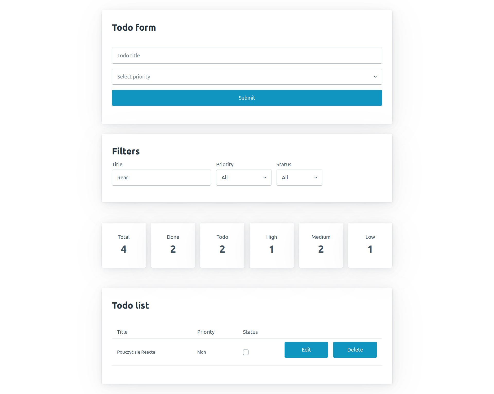

# Todolist app - full CRUD

App todo list that allows create, edit, delete and display todo items.

Written in React.js with little help of Pico CSS - library that boost a little bit development speed.

tutorial on yt (2 parts):

- [Part 1] https://www.youtube.com/watch?v=oxam6oaWdV8
- [Part 2] https://www.youtube.com/watch?v=QPhQUPjemyQ

## Praca domowa

Po przerobieniu tutoriala aplikacja wymaga rozszerzenie o dodatkowe featury:

- komponent do filtrowania todo itemów na podstawie kontrolek (search bar do wyszukiwania po tytule, 2 x selecty do wyboru statusu lub priorytetu)
- komponent metryk do wyświetlania informacji na temat aktualnego stanu listy todos-ów, to co należy wyświetlić to kolejno: liczbę wszystkich todosów (total), liczbę todosów ze statusem równym true (Done), liczbę todosów ze statusem równym false (todo), liczbę todosów z wysokim priorytetem (High), liczbę todosów z średnim priorytetem (Medium), liczbę todosów z niskim priorytetem (Low)

## Wymagania

Nowe featury powinny być umieszczone w nowych komponentach:

- Filters - komponent z inputem textowym oraz dwoma selectami
- Metrics - zbiorczy komponent na komponenty Metric
- Metric - komponent wyświelający pojedyńczą metryke która zawiera labelke oraz wartość

## Podgląd zdeployowanej aplikacji

Jeżeli chcesz podejrzeć działającą aplikacje możesz zajrzeć pod ten link

https://todo-with-metrics.surge.sh/

### Designy aplikacji z nowymi featurami

**All todos**

**Search by priority**

**Search by priority and status**

**Search by title**

### Rozwiązanie

Rozwiązanie zadania jest dostępne w tym repozytorium - w razie nie wiedziała/wiedział byś jak podejsc do zadania możesz śmiało skorzystać i zainspirować się modelowym rozwiązaniem.
